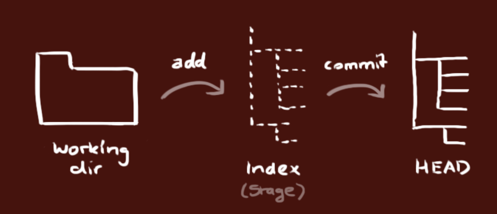
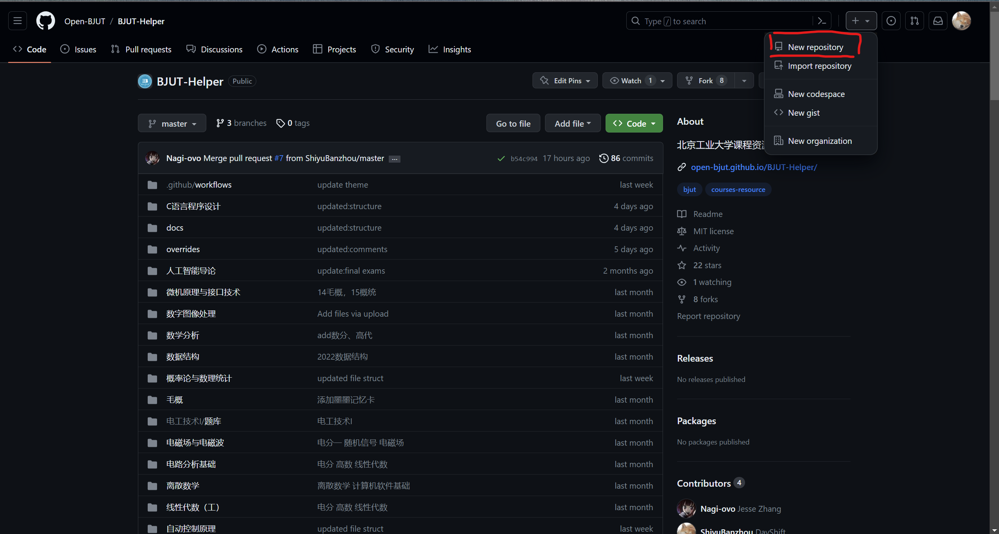
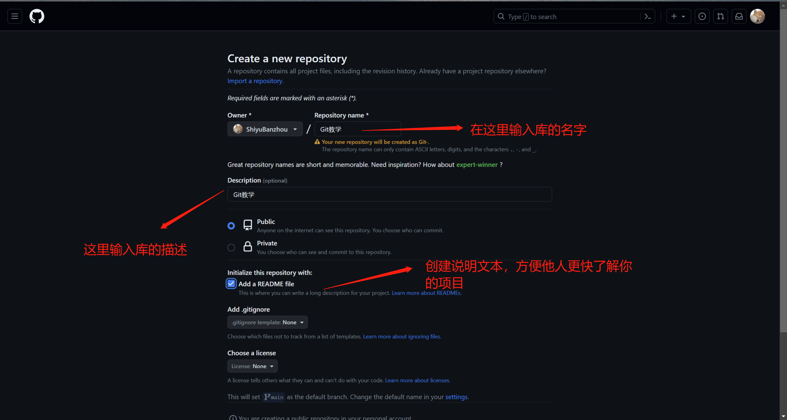
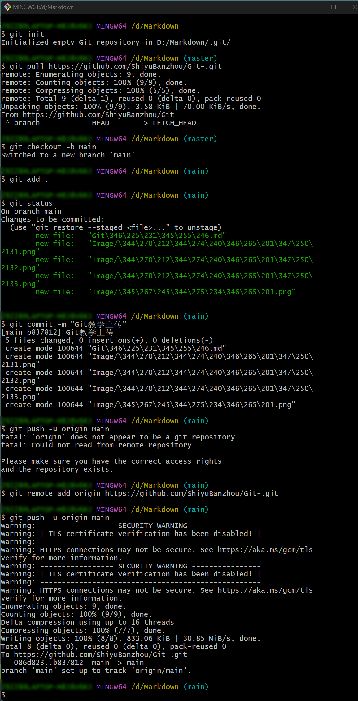

# Git教学
需要掌握的知识：
>1.安装Git并创建Github账号
2.熟悉Git基本指令
3.实现你的第一次Github上传

## 1.安装Git并创建Github账号

### Ⅰ.安装Git
.[下载Git macOs版](https://git-scm.com/download/mac)
.[下载Git Windows版](https://gitforwindows.org/)
.[下载Git Linux版](https://book.git-scm.com/download/linux)

以下安装均指Widows版本下的提示：

>安装包下载好后，在安装的过程中，如无需特殊需求，所有设置按照安装包提供的默认设置即可，安装的目录可以设置在自己常用的硬盘中，推荐安装在非系统盘中。
如需了解每一选项的大致作用，可以跳转至[Windows下Git安装](https://www.bilibili.com/video/BV1Rb4y1C7z1/?spm_id_from=333.1007.top_right_bar_window_history.content.click)了解

### Ⅱ.创建Github账号
登录[Github注册网址](https://github.com/signup?source=login)按照网站提示进行账号注册。
>注意：在创建用户名Username时谨慎选择，在日后参与他人项目或是创建自己项目的过程中，如若频繁更改用户名，可能会造成项目引用链接的失效，造成不必要的麻烦。
##2.熟悉Git基本指令
- [ ] 创建新仓库
>创建新文件夹，打开，然后执行
``````Bash
$git init
``````
>以创建新的 git 仓库。
- [ ] 检出仓库
>执行如下命令以创建一个本地仓库的克隆版本：
``````Bash:
$git clone /path/to/repository
``````
如果是远端服务器上的仓库，你的命令会是这个样子：
``````Bash
$git clone username@host:/path/to/repository
``````
---
工作流
>你的本地仓库由 git 维护的三棵“树”组成。第一个是你的 工作目录，它持有实际文件；第二个是 暂存区（Index），它像个缓存区域，临时保存你的改动；最后是 HEAD，它指向你最后一次提交的结果。

---
- [ ] 添加和提交
>你可以提出更改（把它们添加到暂存区），使用如下命令：
``````Bash
$git add <filename>
$git add *
``````
这是 git 基本工作流程的第一步；使用如下命令以实际提交改动：
``````Bash
$git commit -m "代码提交信息"
``````
现在，你的改动已经提交到了 HEAD，但是还没到你的远端仓库。
- [ ] 推送改动
>你的改动现在已经在本地仓库的 HEAD 中了。执行如下命令以将这些改动提交到远端仓库：
``````Bash
$git push origin master
``````
>可以把 master 换成你想要推送的任何分支。
---
如果你还没有克隆现有仓库，并欲将你的仓库连接到某个远程服务器，你可以使用如下命令添加：
``````Bash
$git remote add origin <server>
``````
如此你就能够将你的改动推送到所添加的服务器上去了。
- [ ] 分支
>分支是用来将特性开发绝缘开来的。在你创建仓库的时候，master 是“默认的”分支。在其他分支上进行开发，完成后再将它们合并到主分支上。

创建一个叫做“feature_x”的分支，并切换过去：
``````Bash
$git checkout -b feature_x
``````
切换回主分支：
``````Bash
$git checkout master
``````
再把新建的分支删掉：
``````Bash
$git branch -d feature_x
``````
除非你将分支推送到远端仓库，不然该分支就是 不为他人所见的：
``````Bash
$git push origin <branch>
``````
- [ ] 更新与合并
>要更新你的本地仓库至最新改动，执行：
``````Bash
$git pull
``````
以在你的工作目录中 获取（fetch） 并 合并（merge） 远端的改动。
要合并其他分支到你的当前分支（例如 master），执行：
``````Bash
$git merge <branch>
``````
在这两种情况下，git 都会尝试去自动合并改动。遗憾的是，这可能并非每次都成功，并可能出现冲突（conflicts）。 这时候就需要你修改这些文件来手动合并这些冲突（conflicts）。改完之后，你需要执行如下命令以将它们标记为合并成功：
``````Bash
$git add <filename>
``````
在合并改动之前，你可以使用如下命令预览差异：
``````Bash
$git diff <source_branch> <target_branch>
``````
## 3.实现你的第一次Github上传
>.首先登录已创建的Github账号，点击Github主页右上方的加号，点击里面的New repository。

---
>.在弹出的界面，填写好所要创建库的基本信息，包括简练的库名称、库概要，推荐勾选创建README.md文档利用Markdown语言进行编写，方便他人更快的了解库的基本概要。如果对Markdown语言感兴趣可跳转至[Markdown教学](https://www.bilibili.com/video/BV1JA411h7Gw/?vd_source=5c35b9cbf8d758302c1e99de23a6465f)进行学习。

---
>.随后在本地想要上传至Github库的文件夹中点击右键->显示更多选项->Git Bash Here 打开命令窗口进行交互

---
>.在Git Bash中利用所学的Git基本命令依次进行

库的创建
``````Bash
$git init
``````
从远程获取代码并合并本地的版本
``````Bash
$git pull https://github.com/ShiyuBanzhou/Git-.git
``````
>注：该命令中的网址链接需要与所要进行操作的库一一对应，可通过在目标库中点击绿色按钮code，复制弹出的HTTPS中的链接进行获取


添加origin主机，与目标库进行关联，此处链接获取方法与上述相同。
``````Bash
$git remote add origin https://github.com/ShiyuBanzhou/Git-.git
``````
>注：如需移除origin主机，可通过如下代码实现
``````Bash
$git remote remove origin
``````
添加文件到暂存区
>如需全部添加可实现代码
``````Bash
$git add .
`````` 
>如需添加指定的文件可实现代码,其中filename为对应的文件名称
``````Bash
$git add <filename>
``````
提交暂存区至本地仓库
>-m后""中的内容为本次提交的备注，可以使他人以及自己更清晰的了解本次库更新了哪些内容，力求言简意赅。
``````Bash
$git commit -m "message"
``````
>注：在add以及commit后，均可通过输入以下代码进行验证添加与提交是否成功。
``````Bash
$git status
``````
上传远程代码并合并
``````Bash
$git push -u origin <branch>
``````
>注：<branch>要与所在分支相对应
---
下面提供一次完整示例：

---
这样，你就从0到1独立自主的完成了一次完整的Github上传！

Git 是一个功能强大、灵活且广泛使用的版本控制系统。通过掌握基本的 Git 命令，你将能更好地管理自己的项目，同时与他人协作开发也能更加顺利。祝愿你在学习和开发的道路上取得成功！

如果你有任何疑问或需要更多帮助，请随时向我们提问或查阅 Git 官方文档（https://git-scm.com/documentation）。

Happy coding！

